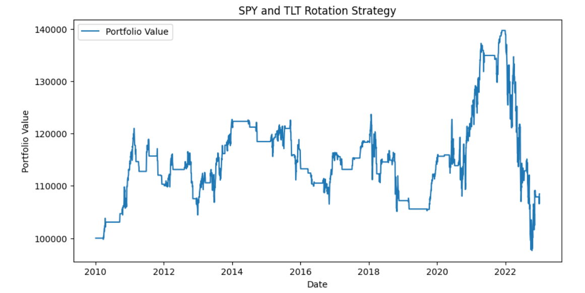

# Bond Rotation Strategy Using TLT and SPY



## Summary

The Bond Rotation strategy is a simple trading algorithm that switches between SPY (an ETF tracking the S&P 500) and TLT (an ETF tracking long-term U.S. Treasury bonds) based on the moving average of TLT. The strategy aims to minimize risk and maximize returns by investing in SPY when TLT's price is below its moving average and moving to cash when TLT's price is above its moving average.

The strategy is implemented in Python using the yfinance library to fetch historical data, pandas for data manipulation, and matplotlib for visualization. The code performs the following steps:

Load historical adjusted closing prices for SPY and TLT.
Calculate the moving average of TLT over a specified number of days.
Iterate through the historical data and execute buy/sell decisions based on the relationship between TLT's price and its moving average.
Track the portfolio value over time and plot the results.

## Strategy Description

The Bond Rotation strategy works as follows:
1. Calculate the moving average of TLT over a specified number of days.
2. If TLT's price is below its moving average, invest the entire portfolio in SPY.
3. If TLT's price is above its moving average, move the entire portfolio to cash.
4. Track and plot the portfolio value over time.

## Requirements

- Python 3.7 or higher
- Pandas
- yfinance
- matplotlib

You can install the required libraries using the following command:
```bash
pip install pandas yfinance matplotlib
